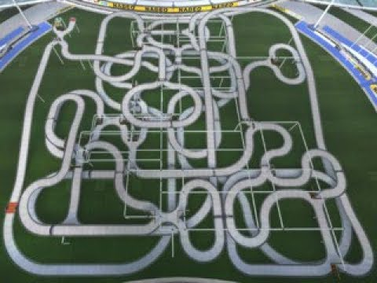

# TMNF-E02-Opti

## The most incredible optimization project on a video game. 

___

## Le projet : 
_______

Le but de notre projet était de répondre à la problématique : Quelle est la meilleure façon de parcourir les différents checkpoints d'un circuit pour le terminer le plsu rapidement possible ? 

Nous nous intéressons ici au cas particulier du circuit E02 du jeu vidéo TrackMania Nations Forever

___
    
Nous nous sommes intéressés à ce circuit en particulier puisque c'est le circuit possèdant les plus de voies alternatives et de checkpoints à valider de la série de jeu TrackMania.

Pour le petit historique, plusieurs millions de joueurs essayent tant bien que mal d'inscrire leur temps dans le haut du classement de chaque circuit. De 2008 à 2019, le record de E02 n'a cessé de baisser jusqu'à atteindre les 3:48.59, record réalisé par Wirtual.

Le niveau de jeu des joueurs experts étant assez homogène, les places dans le top 100 se jouent à quelques centièmes de secondes.

Il y a de cela 10 mois, Wirtual bat son propre record du monde de plus de 14 secondes. 
Pour réaliser cet exploit, Wirtual a utilisé de noumbreux "cuts" (passage d'une partie à une autre du circuit, non prévu par les créateurs). Tous ces cuts étaient déjà largement connus parmis les meilleurs joueurs, mais il était assez compliqué de savoir si ils pouvaient ou non faire gagner du temps, et si oui dans quel ordre les prendre. 
Le nombre de cuts possibles étant trop élevé pour une recherche exhaustive, sans compter sur la difficulté de réalisation de certains d'entre eux, Wirtual décida de chronométrer tous les passages possibles et d'exprimer ce problème comme un problème de voyageur de commerce (Traveling Salesman Problem).

> Le problème du voyageur de commerce, ou problème du commis voyageur, est un problème d'optimisation qui, étant donné une liste de villes, et des distances entre toutes les paires de villes, détermine un plus court chemin qui visite chaque ville une et une seule fois et qui termine dans la ville de départ. 

Ici, les villes constitueront les checkpoints et la distance sera définie comme le temps nécessaire pour aller d'un checkpoint à un autre. Nous pouvons noter qu'il s'agit d'un problème dit TSP asymétrique puisque il n'est pas toujours possible de faire la jonction entre deux checkpoints dans les deux sens.

Notre objectif dans ce projet est donc d'essayer de réaliser la même étude, en s'appuyant sur différentes méthodes de résolution, à savoir : l'algorithme de Little (Branch and Bound) et une modélisation du problème sous forme de Programmation Linéaire en Nombres Entiers

## L'avancement du projet
____

Nous avons décider d'organiser notre travail dans l'odre suivant : 
* **Obternir un version fonctionnelle avec l'algorithe de Little, sur l'exemple du polycopié**
* **Réussir à importer nos données depuis un fichier csv pour faciliter l'importation des temps**
* **Tester l'algorithme de Little sur un circuit de notre cru (Avec peu de checkpoints)**
* **Obtenir une version fonctionnelle de la version PLNE (Miller-Tucker-Zemlin)**
* Obtenir une version fonctionnelle de la version PLNE (Dantzig-Fulkerson-Johnson)
* Récupérer les données de temps du circuit E02
* Importer les données de temps du circuit E02
* Comparer les temps d'éxécution et les résulats de nos différentes approches sur les données de E02
* Comparaison générale des 3 approches
* Optionnel : Test des algorithmes génétiques / fourmillière de résolution de TSP, même si la taille de notre problème ne s'y prête pas vraiment
* Tentative de record du monde par Hugo

Comme vous pourrez être amené à le voir ci-dessous, une majorité des étapes les plus difficiles a déja été réalisée. L'algorithme de Little et la formulation PLNE (M-T-Z) semblent parfaitement fonctionner sur les différents exemples que nous leur avons passés.

Nous avons choisi l'approche "dictionnaire" plutôt que l'approche matricielle pour la description puLp du problème, puisque contrairement à un problème TSP plus "classique", une majorité des trajets ne peut pas être réalisé dans un temps raisonnable. Une modélisation matricielle aurait défini beaucoup de contraintes inutiles et complexifié notre problème.

Finalement, nous allons passer les prochains jours à nous atteler à la modélisation (D-F_J) du modèle PLNE et à la comparaison de nos différentes méthodes.

Le fait que la majorité des trajets ne soit pas possible semble "diminuer la complexité" de l'algorithme de Little et nous avons été agréablement surpris du peu de braches explorées pour la résolution de notre exemple jouet à 8 checkpoints. Alors que l'algorithme est censé exploser en complexité bien avant la marque des 26 villes, nous sommes pressés de voir si l'algorithme parviendra tout de même à trouver meilleur chemin

Comme écrit dans la liste des tâches, nous essaierons également d'effectuer quelques tests d'algorithmes de résolution génétiques, bien que notre problème soit de taille assez faible pour être résolu de manière exacte en un temps convenable
